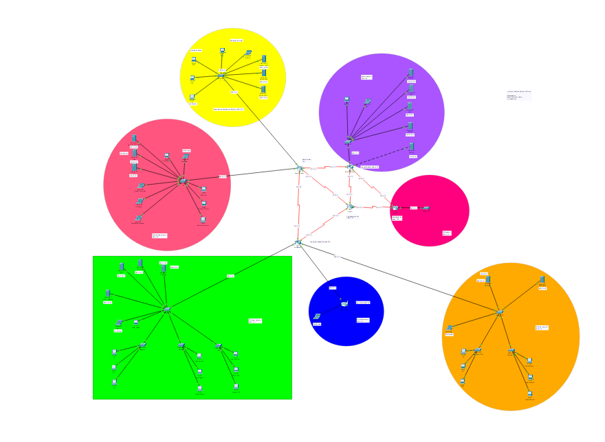
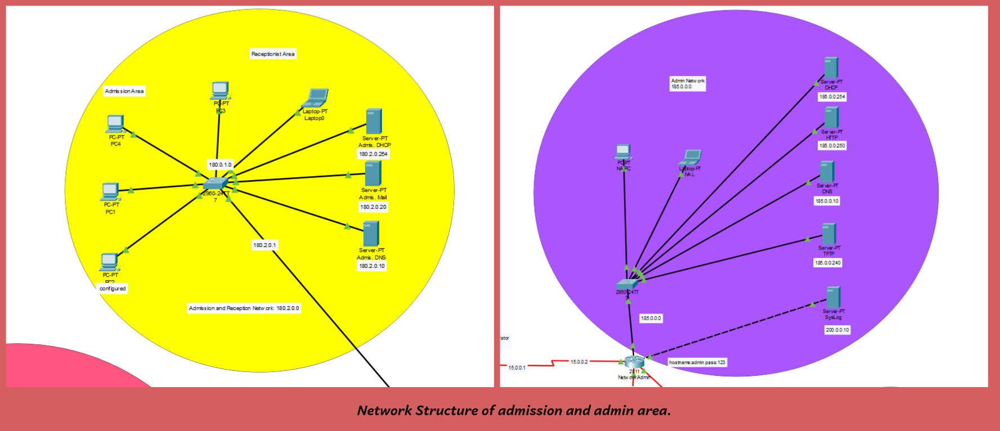
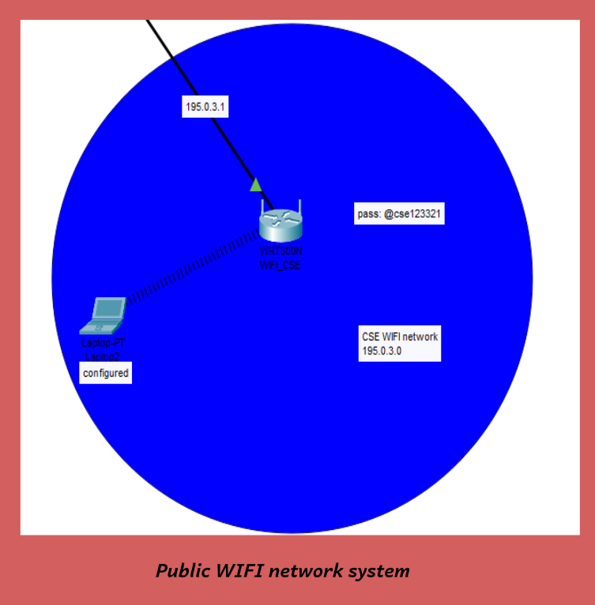
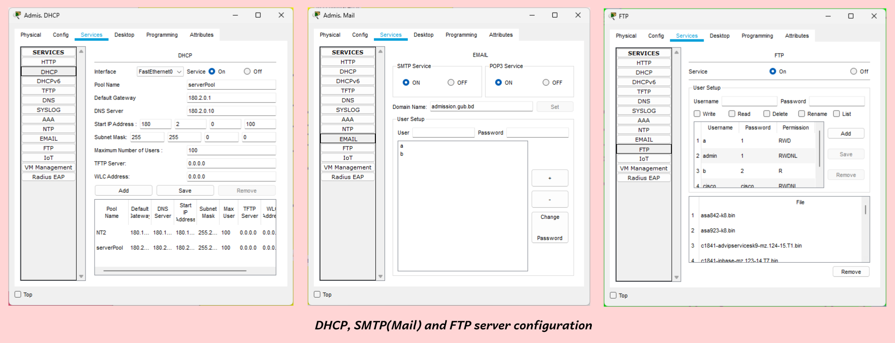

# UCNS
A complete University network system using CISCO packet tracer.

This network system simulates a real campus network architecture and all the necessary data sharing and communication fea-tures. It connects multiple departments and students’ devices to the network services using automated DHCP. The project also simulates web communication protocols and services like SMTP, FTP, DNS, and HTTP server.

### Network structure
**Complete network**

### Public Wireless Router

### Server Configs

